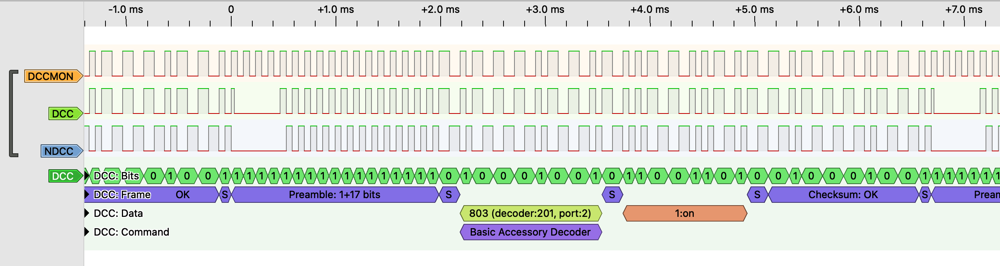

# Work in Progress

## Overview

This library is designed to generate Digital Command Control (DCC) packets for model railway applications. It produces DCC signals fully compliant with the Rail Community standards (RCN), ensuring correct timing, structure, and behavior as defined by the DCC specification. It is intended for use in DCC command stations, not in mobile or accessory decoders.

The library was originally developed for use in the **Z21pg command station** project, but it is intentionally designed to be reusable and flexible. As such, it can also be used as a core component in other custom-built DCC command stations or related DIY projects.

At its core, the software consists of a DCC packet generator and a packet scheduler. The packet generator is responsible for translating each DCC message into the correct bit pattern on the track signal. The packet scheduler controls when and how often packets are transmitted, manages packet repetition, and determines message priority to ensure time-critical commands are sent reliably.

The library is built around a modular architecture, separating protocol logic from hardware-specific implementation details. This design makes it relatively straightforward to add support for new microcontrollers by implementing additional hardware driver variants, without affecting the core packet generation and scheduling logic.

---

## Credits and Historical Background

This library is the result of contributions from several developers within the DCC and Arduino community, whose work forms the technical foundation of the project.

The original concepts for DCC waveform generation and the core routines were developed by **Wolfgang Kufer** as part of the OpenDCC project.
**Don Goodman-Wilson**, through the Railstars CmdrArduino project, adapted these routines for use on Arduino hardware. He introduced the packet scheduling logic and handled the initial integration with Arduino timers and interrupt-based processing.

**Philipp Gahtow** significantly reworked the waveform generator to support multiple microcontroller platforms, including Arduino and ESP-based systems. His contributions include the addition of service mode support, RailCom cutouts, and multiple independent DCC output signals. These additions were used for his Arduino Z21pg central station: http://pgahtow.de/wiki/index.php?title=Zentrale.

More recently, **Aiko Pras** and **Rob van Hoeijen** restructured the library to improve its internal modularity and separation of concerns. This refactoring significantly simplifies the addition of support for new microcontroller platforms and hardware variants, making the codebase easier to extend and maintain going forward.

---

## Generated Signals and Operating Modes

The library can be used in two different operating modes: **Z21pg mode** (default) and **stand-alone mode**. Each mode defines which signals are generated and how they are intended to be used in hardware.

In **Z21pg mode**, the library outputs up to three signals on dedicated processor pins. These consist of a DCC rail signal, an inverted DCC rail signal, and an optional monitor signal. Both DCC rail signals can optionally include a RailCom cutout (gap), allowing RailCom feedback to be supported directly. In addition, both rail signals can be disabled using a power-down control, for example in response to a short circuit or an explicit user request.

This mode is optimized for use with an **L6203 H-bridge**. Because both the normal and inverted DCC rail signals are provided, the L6203 can be driven directly without the need for external logic components.

The optional **monitor signal** always carries a continuous DCC signal. It never includes a RailCom cutout and remains active even when the rail outputs are powered down. This makes the monitor output particularly useful as a DCC source for DCC-based LocoNet Railsync or the S88N Raildata line. An example of the generated signals is shown in the figure below.

In **stand-alone mode**, the library generates only two output signals: a continuous DCC signal and a separate signal indicating the RailCom cutout. Depending on the type of H-bridge used, additional external logic may be required to combine these signals into a proper rail output.

---

## Signal Generation and Timing Accuracy

The way DCC signals are generated depends on the selected operating mode and has a direct impact on timing accuracy and signal jitter.

In **Z21pg mode**, all three output signals are generated in software using a timer-driven interrupt service routine (bit-banging). The main advantage of this approach is portability: the signal generation logic is largely processor-agnostic, making it relatively easy to adapt the library to new microcontroller platforms. The downside is that, depending on the chosen processor, timing jitter may be present in the generated DCC signal. This effect is noticeable on platforms such as the ESP32 and classic Arduino boards like the UNO and MEGA, where interrupt latency and background system activity can influence timing precision.

In **stand-alone mode**, the DCC signals are generated entirely in hardware. As a result, the output signals are free of jitter and exhibit superior timing accuracy. By leveraging dedicated hardware peripherals available on modern microcontrollers—such as DMA, RMT, or PIO—the CPU load is kept to a minimum while maintaining very high signal quality.

---

## Supported Microcontrollers

The set of supported microcontrollers depends on the selected operating mode.

For **Z21pg mode**, the library supports a wide range of processors. This includes traditional 8-bit Arduino ATmega microcontrollers such as the **ATmega328** (used in Arduino UNO and NANO boards) and the **ATmega2560** (Arduino Mega). Newer 8-bit ATmega devices are also supported, including the **AVR-DA** and **AVR-DB** families as provided by the DxCore platform.

In addition to 8-bit devices, several **32-bit microcontroller platforms** are supported in Z21pg mode, including the **ESP32**, **ESP8266**, **SAMD**, and **STM32** families.

It should be noted that for **stand-alone mode** this library is still under active development and therefore not yet complete.

---

## Installation

To install this library, see the general instructions for Arduino library installation here:
https://docs.arduino.cc/software/ide-v1/tutorials/installing-libraries/
