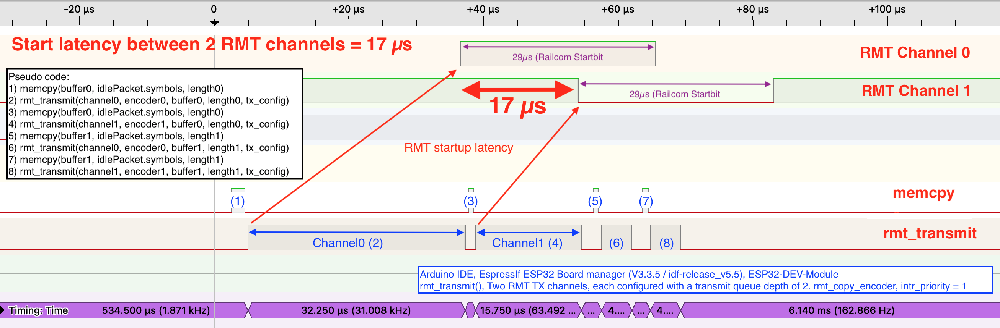

# Multiple RMT channels?

Often, it may be attractive to generate multiple (synchronized) DCC output signals. For example, H-bridges based on L620x driver chips (as in the case of the Z21PG), or discrete MOSFETs (possibly with HIP/IRS gate drivers), may require, in addition to the normal DCC signal, an inverted DCC signal. Other driver chips (such as the DRV8874) expect a dedicated RailCom-gap-enabled signal. Therefore, it may seem interesting to configure the RMT in such a way that two synchronized channels become active.

The figure below captures the temporal behavior of starting two independent ESP32 RMT transmit channels, each configured with a transmit queue depth of two, when both channels are loaded back-to-back with the same precomputed waveform.

The application starts by using memcpy to fill the RMT input buffer (**1**), after which it calls `rmt_transmit()` for Channel 0 (**2**). The Channel 0 output signal does not appear immediately; in the figure above, 32.5 µs elapses between the start of `rmt_transmit()` and the first observable activity on the output pin. This time is required for the RMT driver to configure and enable the RMT TX channel, transfer the data provided to `rmt_transmit()` into the channel FIFO, and start the internal transmit state machine.

The first RMT symbol we see on the output pin of the figure above is the 29 µs RailCom gap, which is part of the intended DCC waveform.

Immediately after starting Channel 0, Channel 1 is also started (**4**) with its own `rmt_transmit()` request. Channel 1 undergoes mostly the same cold-start sequence as Channel 0: it must be independently configured, its FIFO prepared, and its state machine enabled before symbols can be emitted. However, since the RMT peripheral itself is already running, this second `rmt_transmit()` call takes 'only' 15.75 µs, instead of the 32.5 µs that as needed for the first call.

Although both channels are started back-to-back in software and carry identical data, they do not begin transmitting simultaneously. As a result, the first symbol on Channel 1 appears about 17 µs later than on Channel 0. This delay represents an inter-channel startup skew introduced by the IDF v5 RMT driver implementation.

The root cause of this skew is the substantial CPU time required to configure and start the first packets on each channel (32.25 µs for Channel 0 and 15.75 µs for Channel 1), as each RMT channel must be fully initialized before transmission can begin. The second channel is faster to start because the RMT hardware is already running. Once both channels are active, filling the FIFO for subsequent packets (6 and 8) is much faster, since the channels are already initialized and the hardware transmit engine is operating.

It should be noted that the skew occurs even if the channels are fully configured well before enabling transmission; enabling them immediately before calling rmt_transmit() or after does not remove the offset. In principle, one could manipulate the length of the first and last bits to achieve momentary synchronization between channels, but this alignment is lost as soon as the queue is updated for the next packet (see figure below). Any attempt to compensate for this drift must be performed in normal CPU time, making it dependent on CPU clock speed and vulnerable to interruptions by ISRs. Consequently, achieving precise synchronization across multiple RMT transmit channels with IDF v5 is inherently unreliable.

In summary, we found that (IDF v5) when two RMT channels with queue depth 2 are configured back to back:
- Each channel requires a non-negligible internal setup time before its first symbol can be emitted.
- When two channels are started back-to-back, their first symbols are offset by about 17 µs.
- Even when both channels are synchronized within a packet, a new offset appears before the next packet.

Thus, if multiple output signals are needed, such as inverted or RailCom-gap signals for H-bridge and MOSFET drivers, it is generally better to rely on external logic. Likewise, any signal required to enable or disable the H-bridge during the RailCom gap should be generated by a standard ESP32 timer rather than a second RMT channel.
