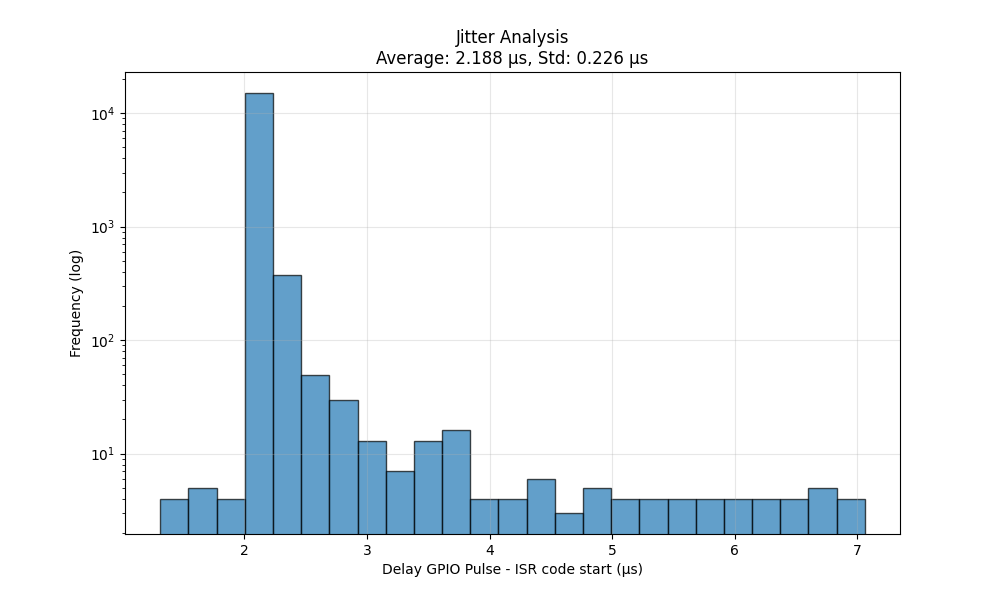

# Comparison between different processors

Below we discuss the suitability of vraious modern processors for DCC signal generation.

Following the development of functional Z21PG (bit-banging) drivers for common processors (AtMega, DxCore, ESP32 and STM32), the next step was taken and a number of HQ drivers were developed. The aim of these drivers is to utilise the powerful peripherals offered by modern processors, such as advanced timers, PWM, DMA, RMT and PIO. To this end, the state machine used in the “bit-banging” code has been replaced by an approach in which the entire DCC signal is calculated in advance, including the exact timing of all bits.

Implementations have been created for DxCore, STM32, ESP32 and RP2040/2350 processors. Whilst building these implementations, we encountered a number of surprising experiences, which we discuss below. We begin with the processor we consider least suitable for generating DCC, and end with the processor that seems most suitable to us

## ESP32
We are somewhat disappointed with the ESP32. On paper, the so-called RMT timer is ideal for generating DCC signals, and it is indeed used in projects such as DCC-ex and OpenRemise. Within a single DCC packet, the RMT provides an excellent DCC signal and there is no jitter. The problem arises, however, between DCC packets. Due to the combination of FreeRTOS, the relatively heavy ESP-IDF hardware abstraction layer (HAL), and the (as far as DCC is concerned) inadequate IDF v5 (i.e. the current version) RMT drivers, there is a significant delay when reconfiguring the RMT for the next packet. This delay is typically around 20 to 30 microseconds and is, moreover, not constant.

Measurements show that the jitter averages around 2 microseconds, but can rise to 7 microseconds or more, with outliers reported on some internet forums to be even above 10 microseconds, particularly during Wi-Fi activity. Because this jitter occurs both between DCC packets and at the RailCom cut-out, the signal does not always meet the DCC specifications. As far as we are concerned, this makes the ESP32 the least suitable for DCC signal generation.

## DxCore
The DxCore family, such as the AVR64DA48, performs significantly better; it can be seen as the modern successor to the classic Arduino processors (AtMega 328, 2560). Here we use TCA0 for the DCC signal and TCD0 (which is usually unused) for the RailCom cutout. As these processors do not support DMA, an interrupt is triggered after every DCC bit (116/200us) in which the timer registers are set for the next bit.

In practice, this results in an extremely stable DCC signal, with no jitter between packets. The RailCom cutout timer is activated in the ISR at the start of each packet, which can lead to some jitter in the cutout, depending on any other interrupts. Attempts to link the cutout timer entirely via hardware to the DCC timer (for example via the event system) were unsuccessful. Nevertheless, the DCC signal itself is jitter-free, although this is accompanied by a relatively high CPU load due to the many interrupts.

## STM32
The STM32 series consists of modern 32-bit microcontrollers and is characterised by great diversity. There are several families, such as the C, F, G and H families, and within each family there are a number of variants (such as the F1 and F4). Although all STM32s share a common basis, the variants differ considerably from one another in terms of, for example, DMA architecture, caching, memory structure and available peripherals. In practice, this means that (Arduino) code is not readily transferable between different STM32 variants, and that adjustments are often necessary for each variant. We have created implementations for the F4 and H7 series, in which we did not use FreeRTOS.

We used Timer 3 and DMA to generate the DCC signal, and Timer 4 for the RailCom cutout. The entire DCC packet is placed in a DMA buffer in advance, so that signal generation is entirely hardware-based. An interrupt is only required at the end of each DCC packet to reconfigure the DMA channel, supplemented by Timer 4 interrupts at the start and end of the cutout.

As several tens of microseconds are available per packet for this reconfiguration, there is in practice no jitter between successive DCC packets. For the RailCom cutout, some jitter is theoretically possible, but in practice this proved to be undetectable, partly because the interrupt priority is adjustable and can be optimised.

The result is a very stable and clean DCC signal, with low CPU load, as only a limited number (3) of interrupts per packet are required.

## RP2040/RP2350
The biggest surprise for us were the RP2040 and RP2350, known from the Raspberry Pi Pico.
Original Raspberry Pi Pico boards cost around 5 euros, and small boards are available from around 1.5 euros. The RP family has only two variants, which are largely software-compatible and feature an interesting peripheral: the PIO (Programmable IO). This is essentially a small, specialised co-processor capable of generating very precisely timed output signals. In combination with DMA, the entire DCC signal, including the RailCom cutout, can be generated entirely by a single PIO (within which we use two state machines with very simple code).

Our RP implementation delivers a perfectly stable DCC signal, without any jitter between packets or the cutout. Moreover, the implementation is relatively simple and the CPU load is minimal: just one interrupt per packet. With a clock speed of 125 to 200 MHz and a dual-core architecture, the RP2040 also offers a great deal of processing power.

As far as we are concerned, the RP2040 is therefore the most suitable processor for DCC signal generation. A disadvantage, however, is the limited number of ADC pins and the relatively poor quality of the ADC, which makes this processor less suitable for occupancy detectors, for example.

## Conclusion
Whilst the ESP32 disappoints due to its unoptimised RMT driver implementation and jitter issues, both DxCore and STM32 generate a good DCC signal, albeit with different trade-offs. The RP2040/2350, however, stands out: with the best DCC signal quality, the lowest CPU load, low cost and a comparatively simple implementation.
