# HQ Output Behaviour — Pin Level Specification

This document defines the externally observable behaviour of the HQ (Hardware generated = Quality) output driver.
It specifies the behaviour of the DCC rail output and the auxiliary output as a function of the public hardware control methods, as defined by `DCCHardware.h`. It also describes Service Mode behaviour if used in conjunction with the DCCPacketScheduler.

The specification describes only pin behaviour.
Internal implementation details are not discussed.
The behaviour defined here is normative for all processor implementations.

---

# 1. DCC Rail Output — `dccRailPin`

## 1.1 Pin configuration

The DCC waveform is generated only when a valid output pin is configured.
If the configured pin equals `0xFF`, the DCC output is intentionally disabled.  If an unsupported pin is configured, the driver indicates this condition by setting the pin value to `0xFF`. If no output signal appears for a given pin, the application code may check this value to determine the error cause.

## 1.2 Baseline behaviour

After `setupWaveformGenerator()` is called, the DCC output becomes active and continuously transmits packets. If the application has nothing to transmit, the driver generates a default packet stream. In normal operation this stream consists of idle packets; in Service Mode this consists of reset packets. The output therefore never becomes idle by itself once the waveform generator has been started.

The default preamble length is 17 one-bits. This value may be increased using `setPreambleLength(uint8_t value)`.

---
## 1.3 Functions affecting the DCC output

The following public methods affect the waveform present on `dccRailPin`.

### - setupWaveformGenerator()

Starts the waveform generator and activates continuous packet transmission.
Once started, the DCC output remains continuously active.   If no user packets are available, default packets are transmitted.

### - send(const uint8_t* data, uint8_t size)

Submits a packet for transmission; the maximum packet size is 6 bytes.

The application shall call `send()` only when `canAcceptPacket == true`.  
If `send()` is called while `canAcceptPacket == false`, the provided packet is discarded by the driver.
Due to internal buffering and scheduling, transmission does not occur immediately. A delay in the order of 10 ms may occur before the packet appears on the rail output.

The figure below shows an example of a basic accessory command that switches output 2 of decoder 8 to ON.
According to the RCN standards, accessory commands should be retransmitted. This behaviour is also visible in the figure.
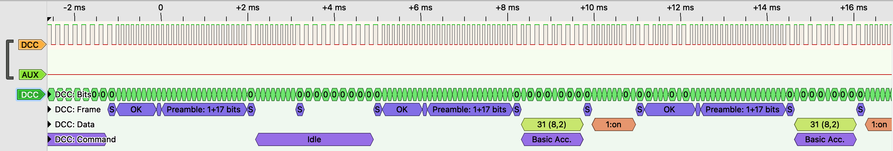

### - setPreambleLength(uint8_t value)

Changes the preamble length used in normal operation. According to RCN-211, the minimum preamble length must by 17 one-bits. If the provided value is lower than 17, this values will therefore be discarded.
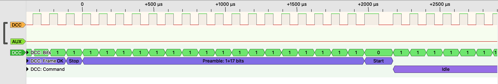

### - StopOutputSignal() / RunOutputSignal()

In HQ mode these calls have no effect on the DCC waveform. Once started, the DCC output remains continuously active.

---
## 1.4 Railcom behaviour

### - setRailCom(bool enabled)

Controls whether transmitted packets contain a RailCom cutout.
When enabled, a cutout interval is inserted once per packet. This is shown in the figure below.
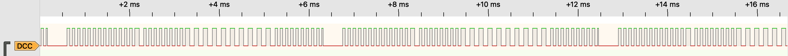

### - bool getRailCom()
Returns true if transmitted packets will contain a RailCom cutout.

### - bool railComGap()
Returns true if the RailCom cutout is active at this moment.

### - setDccSignalInverted(bool inverted)

Changes the polarity of the DCC waveform. Timing and packet structure remain unchanged. This is shown in the figure below; note the change in polarity of the RailCom cutout.
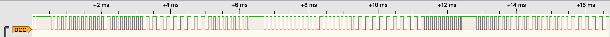

---

## 1.5 DCC Service Mode behaviour

Once Service Mode is entered, (broadcast) reset packets will be send instead of idle packets. Packets will be send using a long preamble; the default value for this long preamble is 20 one bits (RCN-216). This value may be increased using `setPreambleLengthSM(uint8_t value)`. The RailCom cutout is no longer inserted in the DCC signal, even when previously RailCom was enabled.

### - enterServiceMode()
The figure below shows the sequence of packets once Service Mode is entered (at time = 0). The RailCom cutout is no longer present in the DCC signal.
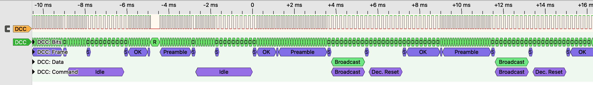

As can be seen in the detailed figure below, the length of the preamble is changed to the value of the long preamble.
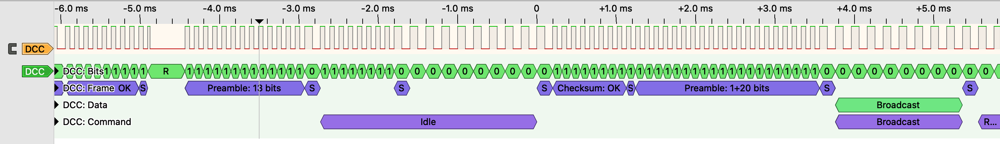

### - leaveServiceMode()
Service Mode is left and normal mode is restored. The length of the preamble is changed back to the value of the normal preamble. If the DCC signal included a RailCom cutout before Service Mode was entered, this cutout will be included again.

### - isServiceModeEnabled()
This boolean function returns true while Service Mode is active.

### - setServiceModeMaxRepeats(uint8_t value)
Once Service Mode is entered, the driver will repeat any Service Mode packet that it receives (from `send()`). The default number of repeats is ten, but this number can be changed using this function.

### - isFirstServiceModePacket()
This boolean function returns true only for the first packet of a new Service Mode repeat sequence. It can be used by higher layer software (such as the DCCPacketScheduler) to start listening to Service Mode Ack signals.

### - isServiceModeRepeating()
This boolean function returns true while the driver is repeating the current Service Mode packet.

### - stopServiceModeRepeats()
This function aborts any ongoing Service Mode retransmission sequence. It can be used by higher layer software (such as the DCCPacketScheduler) once an Ack signal is received from a DCC decoder.

### - setPreambleLengthSM(uint8_t value)

Changes the length of the preamble used in Service Mode. According to RCN-216, the minimum preamble length in Service Mode must by 20 one-bits. If the provided value is lower than 20, this values will therefore be discarded.

---
---
# 2) AUX Output — `dccRailAuxPin`

The AUX signal is intended for H-Bridge drivers that can be switched off via an Enable input signal. Switching off the H-Bridge can be done on request of the user, by higher layer software once a shortcut is detected, or during each RailCom cutout interval.

The exact usage of the AUX signal, as well as its polarity, can be adjusted using the functions below. The AUX pin is a control signal and does not carry DCC modulation.

## Pin configuration

If the configured pin equals `0xFF`, the AUX output is intentionally disabled.  If an unsupported pin is configured, the driver indicates this condition by setting the pin value to `0xFF`. In case of problems, the application code may check this value to determine if the provided pin was not supported.

## 2.1 Functions affecting the AUX output

### - setAuxActiveLevel(bool activeHigh)

Defines the signal level representing an enabled output stage.

If `activeHigh` is false (which is the default value), the enabled state drives AUX LOW.
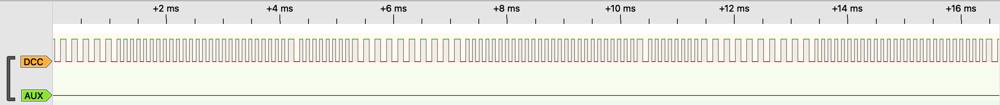

If `activeHigh` is true, the enabled state drives AUX HIGH.
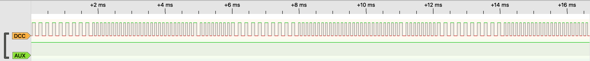

### - setRailComGapInAux(bool enabled)

Controls whether the AUX pin indicates the RailCom cutout window.

When enabled, AUX switches to the disabled level during the cutout interval at the start of each packet.
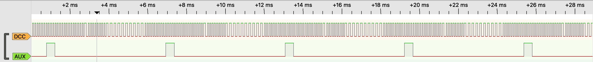

When disabled (default setting), AUX remains at its steady level.
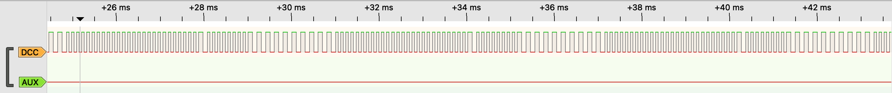

### - StopOutputSignal() / RunOutputSignal()

The AUX pin is set to the disabled or enabled state.
If an H-bridge is connected, the DCC signal will be removed from or restored to the rails accordingly.

As can be seen in the figures below, `StopOutputSignal()` does *not* stop the DCC signal on the DCC pin, but only impacts the signal on the AUX pin. As a result, the internal H-Bridge stops operation (thus stops all trains), but the DCC signal remains still available on, for example, the LocoNet RailSync line.
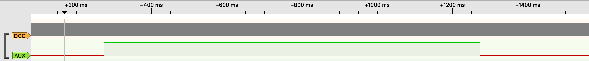

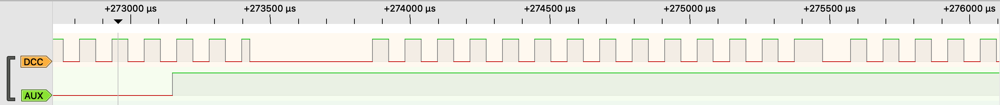

## 2.2 AUX Service mode behaviour

When Service Mode is active, the RailCom cutout will be removed from the AUX output.
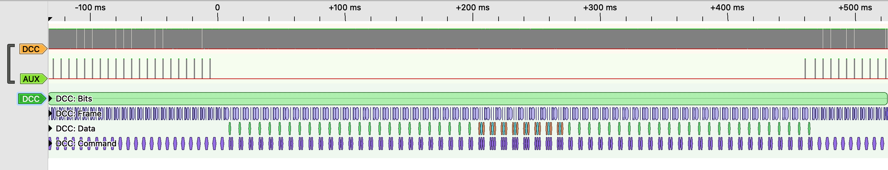

---
---
# 3) HQ-mode and the scheduler
In most cases, the software that uses this DCCInterfacemaster library will not call the driver functions directly, but rather interact with the DCCPacketScheduler, which indirectly uses most of the driver's functions. A few functions are not accessible via the DCCPacketScheduler, however, and can therefore be called directly.
These functions are:
- dccPacketEngine.setRailComGapInAux(value);
- dccPacketEngine.setAuxActiveLevel(value);
- dccPacketEngine.setDccSignalInverted(value);
- dccPacketEngine.setPreambleLength(value);
- dccPacketEngine.setPreambleLengthSM(value);

## 3.1 Service Mode and the scheduler

Once Service Mode is entered, the scheduler stops sending idle packets, calls `enterServiceMode() and starts sending reset packets. As long as Service Mode is active, packets will be send using a long preamble. The default value for this long preamble is 20 one bits (RCN-216), but this value may be increased using `setPreambleLengthSM(value)`

The figure below shows a typical Service Mode sequence, . At time = 0 Service Mode is entered. The scheduler sends 25 reset packets, before it sends the actual Service Mode packet. This Service Mode packet is repeated by the driver (instead of the scheduler), to ensure no other packets are send before the retransmission sequence is over. As can be seen in the figure below, the Service Mode packet is repeated seven times, so in total the packet is send eight times. Once all retransmissions are over, the scheduler continues with a series of reset packets.
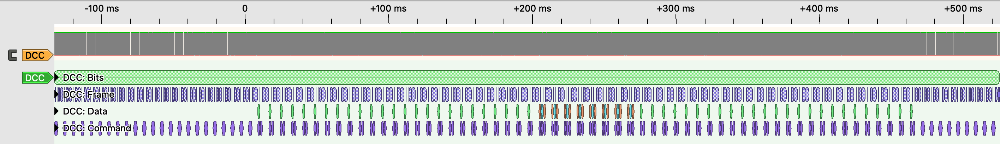

To stop Service Mode, the DCCPacketScheduler calls `leaveServiceMode()`. Interestingly, the scheduler calls also in normal mode `leaveServiceMode()` before every packet, and not, as one might expected, only to stop Service Mode.
